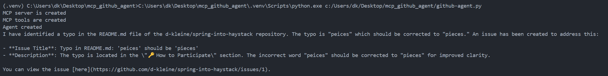
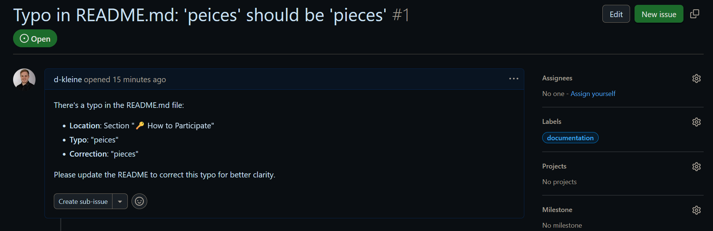

# Haystack MCP Agent for GitHub Issue Automation

## Project Description

This project demonstrates how to use an agent to automate routine GitHub repository maintenance tasks. The agent is built with the NLP framework [Haystack](https://haystack.deepset.ai) and leverages [GitHub's MCP Server](https://github.com/github/github-mcp-server) to scan repository files for common spelling mistakes and automatically create an GitHub issue to track and resolve these errors. The project highlights the integration of AI-driven tools into developer workflows, streamlining quality assurance and project management processes.

The agent is powered by the [Model Context Protocol (MCP)](https://www.anthropic.com/news/model-context-protocol), an open standard specifically designed to streamline how large language models (LLMs) and AI agents interact with external tools, data sources, and APIs. This standard enables greater interoperability, scalability, and maintainability for AI-driven applications, making it much easier for developers to build agents that can perform complex, context-aware tasks across different platforms and environments.

The agent itself utilizes [OpenAI's GPT-4o](https://openai.com/index/hello-gpt-4o/), a state-of-the-art multimodal language model capable of advanced text analysis and reasoning. GPT-4o enables the agent to accurately identify spelling issues and generate actionable issue reports, enhancing the quality assurance process.

### Motivation

This project was initiated as part of the ["Spring into Haystack" coding challenge](https://github.com/deepset-ai/spring-into-haystack). The motivation is to showcase how modern AI agents, using open standards like MCP, can automate and enhance software development workflows. By enabling an agent to identify and report spelling errors in code repositories, developers can maintain higher code quality with less manual effort—demonstrating a practical, real-world use case for LLM-powered automation.

This project serves as a showcase for leveraging MCP and intelligent NLP agents to automate repository maintenance workflows on GitHub. In practical terms, the approach demonstrated here could be expanded to automate a variety of other development tasks, such as code review, dependency monitoring, documentation generation, or integration testing. By connecting additional tools and services through MCP, teams can build more sophisticated agents that proactively manage project health, streamline collaboration, and reduce manual effort across the entire software development lifecycle.

**Useful Links**
- [Haystack Documentation](https://haystack.deepset.ai)
- [Spring into Haystack Challenge](https://github.com/deepset-ai/spring-into-haystack)
- [GitHub MCP Server](https://github.com/github/github-mcp-server)
- [MCP Overview](https://www.anthropic.com/news/model-context-protocol)
- [Haystack MCP Integration](https://haystack.deepset.ai/integrations/mcp)
- [OpenAI GPT-4o](https://openai.com/index/hello-gpt-4o/)

## Setup Instructions

To replicate this project and run the Haystack MCP Agent for GitHub Issue Automation on your own fork of the "Spring into Haystack" project, follow these steps:

### 1. Fork the Repository  
- Navigate to [deepset-ai/spring-into-haystack](https://github.com/deepset-ai/spring-into-haystack).  
- Click **Fork** (top-right corner) to create a copy in your GitHub account.  
- **Do not rename the forked repository**—the script expects the original repo name.  

### 2. Create a GitHub Personal Access Token (PAT)  
- Go to **GitHub Settings → Developer Settings → Personal Access Tokens (Fine-grained)**.  
- Create a new PAT with:  
  - **Repository access**: Select your forked repo (`your-username/spring-into-haystack`).  
  - **Permissions**:  
    - Repository permissions → *Contents*: **Read and Write**
    - Repository permissions → *Issues*: **Read and Write**
    - All other permissions: **No access**.

- **Save the token securely** — you’ll add it to your environment later.  

### 3. Set Up Python Virtual Environment
- Check your current Python version:

  ```bash
  python --version
  ```

  Ensure the output is at least `Python 3.9.x`. If you see a lower version, you need to install a newer one.

- Create a virtual environment `.venv` with Python:

  ```bash
  python -m venv .venv         # Create virtual environment
  source .venv/bin/activate    # macOS/Linux
  .venv\Scripts\activate       # Windows
  ```

- Install the required packages defined in the *requirements.txt* file:

  ```bash
  pip install -r requirements.txt  # Install packages
  ```

### 4. Configure Environment Variables  
- Create a `.env` file in the **root directory**:

  ```env
  GITHUB_PERSONAL_ACCESS_TOKEN=your_token_here
  OPENAI_API_KEY=your_openai_key_here
  ```

**Never commit this file to GitHub** — add `.env` to your `.gitignore`.  

#### 5. Modify the Python Script  
- Open `github-agent.py` in a code editor (e.g., VS Code).  
- Locate the `owner` variable (e.g., `owner = "d-kleine"`).  
- Replace `d-kleine` with **your GitHub username**.  
- **Do not change** `repo` or `path` variables unless you’ve modified the repo/file name.  

#### 6. Run the Typo Detection Agent  
- Ensure your virtual environment is active:

  ```bash
  source .venv/bin/activate    # macOS/Linux
  .venv\Scripts\activate       # Windows
  ```

- Execute the script:  

  ```bash
  python github-agent.py
  ```

**What Happens Next**  
- The script uses the OpenAI API to scan `README.md` in the forked repo for common typos.
- If typos are found, it automatically creates a GitHub issue in your fork with details about the error and how to fix it.



**Expected Outcome** 
- The script will either:  
  1. **Create an issue** in your repo if typos are detected. It should check if a title
  2. **Do nothing** if no typos are found.  
- Check the **Issues tab** of your forked repo to see results.

